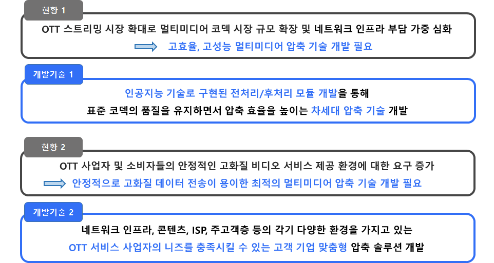
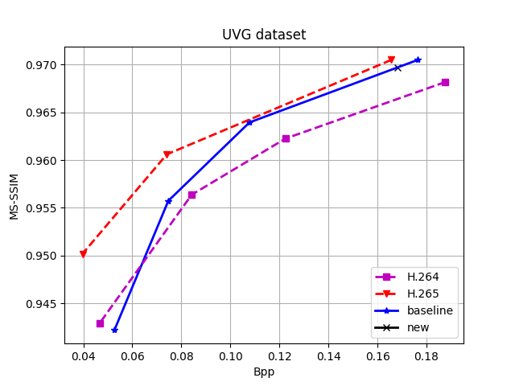
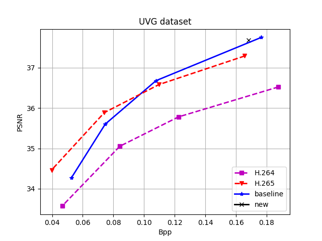

    

**Video&Audio Compression using AI [AionflowCompression](https://github.com/wh-y-j-lee/aionflow_test).**

## Updates
- [2022-02-17] Update v1.4. Check [20220217_Update_Log](https://mvp.yonsei.ac.kr)
    - 학습 코드 에러 수정
    - 새로운 최적 파라미터로 Pretrained 모델 재학습 완료
    - 불필요한 코드 통합, 삭제
- [2022-02-03] Update v1.3. Check [20220106_Update_Log](https://mvp.yonsei.ac.kr)
    - CResMD 기반 스케일, 컨텐츠에 따른 Multi dimension 전이 학습 v1 테스트 코드 추가
- [2022-01-06] Update v1.2. Check [20220106_Update_Log](https://mvp.yonsei.ac.kr)
    - 전,후처리 네트워크를 ArbSR 기반 다중 임의 스케일로 변환 가능한 네트워크로 변경
    - Example 코드 추가 
- [2021-12-16] Update v1.1
    - FFMPEG 코덱 호환 기능 추가
    - 전/후처리 Train 코드 데모 추가
    - Code stabilization 
- [2021-11-25] Test upload alpha version v1.0.

## Overviews/Abstract

    
    

## Method

<figure>
    
    <figcaption>코덱 모델링 신경망 프로세스</figcaption>
</figure>

- 인코딩/디코딩의 전체 과정을 고려한 오차 역전파 기반 학습이 가능한 코덱 모델링 신경망 개발
- 코덱 모델링 신경망은 동영상 신호를 받아서 압축 후 열화된 신호를 출력하며, 코덱을 이용하여 얻을 수 있는 결과와의 오차를 최소화하도록 학습되어 코덱의 과정을 모사하는 역할 수행

    

파라미터 결정 모듈은 인공 신경망 네트워크로 구성되어 Pretrain 및 Finetuning 될 수 있으며 영상의 축소 스케일 값과 컨텐츠 종류를 출력하여 인코딩 및 디코딩 시에 사용된다. 이 정보는 기존 코덱의 Bitstream에 사이드 정보로 추가되어 같이 비트열로 전송되어 디코더 사이드로 전송된다.

사이드 정보 벡터 값을 메인 전처리 및 후처리 네트워크에 적응적으로 반영하기 위해서는 연속적인 Level 처리가 가능한 인공 신경망 기술을 활용해 다양한 크기의 해상도 축소 및 확장 모듈을 사용한다. 예를 들면, 시간 및 공간 축에 대해서 1:1 부터 N:M 까지의 해상도 축소 모듈과 이를 원 해상도로 복원하기 위한 1:1 부터 M:N까지의 인공 신경망 네트워크 모듈을 설계한다. 즉, 전처리 모듈에서 N:M 해상도 축소 모듈을 선택하고, 후처리 모듈에서 M:N 해상도 확장 모듈을 사용하면 최소의 왜곡으로 원 영상을 복원할 수 있다. 전처리/후처리 모듈 학습 과정에서는 기본 코덱의 영향을 무시하고 직접 연결할 수도 있고, 성능을 보다 높이기 위해서는 기본 코덱 모듈의 압축/복원 과정에서 발생하는 왜곡에 대한 영향을 반영할 수도 있다.

또한 파라미터 결정 모듈에서 출력된 컨텐츠 정보는 각 전처리 네트워크 및 후처리 네트워크 층에 반영되어 컨텐츠에 따른 최적의 전처리 및 후처리 모듈을 가능하게 한다. 컨텐츠는 End-to-end 학습으로 사이드 정보 벡터의 연결 고리를 만들어주어 네트워크가 학습을 통해 임의로 결정하게 할 수 있거나 화면 내 복잡성 혹은 화면 간 복잡성을 통해 결정 될 수 있다.

    

전처리 및 후처리 네트워크는 복원 영상과 원본 영상의 Distortion을 손실함수로 정의하여 오차 역전파를 통해 학습된다. 이때 레거시 코덱은 미분 불가능한 양자화 연산을 가지고 있기 때문에 그라디언트의 전달이 불가능하므로 End-to-end 학습이 불가능하다. 이를 해결하기 위해 기존 레거시 코덱을 모델링하여 생성한 코덱 모사 네트워크를 사용하여 기존 코덱 대신 그라디언트의 전달 통로로 사용하여 전처리 및 후처리 네트워크를 동시에 최적화 한다. 

파라미터 결정 모듈은 기존 코덱을 통해 만들어진 영상에서 얻을 수 있는 PSNR, 비트레이트 등을 통해 만들어진 데이터베이스로 학습을 우선 진행한다. 이때 최적의 스케일을 레거시 코덱의 압축 결과로 연산하여 추정하고 그 값을 스케일결정 네트워크가 출력할 수 있도록 한다. 또한 컨텐츠 정보 또한 화면 내 복잡도 및 화면 간 복잡도 등으로 사전에 정의하여 컨텐츠 분류 네트워크가 출력할 수 있도록 학습한다. 이렇게 우선적으로 Pretrained 된 네트워크를 생성하고 스케일 및 컨텐츠 정보가 메인 전처리 및 후처리 네트워크의 각 층에 삽입 될 수 있도록 연결 통로를 형성한 후 최종적으로 End-to-end 학습을 통해 Fine-tuning을 진행한다. 이렇게 생성된 전처리 및 후처리 모듈, 파라미터 결정 모듈은 실제 인코딩 및 디코딩 시에 각 앞 뒤 단에 연결되어 압축률을 향상하는데 도움을 준다.

## Results

    
    

