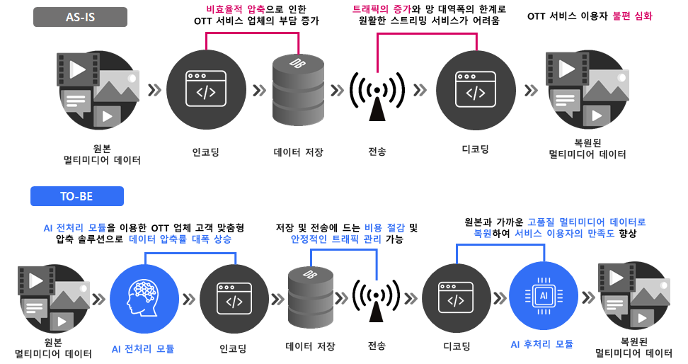

    

**Video&Audio Compression using AI [AionflowCompression](https://github.com/paddlepaddle/paddle).**

## Updates
- [2022-02-17] Update ~~~. Check [20220217_Update_Log](mvp.yonsei.ac.kr)
    - Fix ~~ issues
    - Add ~~
    - Add ~~
    - Delete ~~
- [2022-02-03] Update ~~~. Check [20220106_Update_Log](mvp.yonsei.ac.kr)
    - Fix ~~ issues
    - Add ~~
    - Add ~~
    - Delete ~~
- [2022-01-06] Update ~~~. Check [20220106_Update_Log](mvp.yonsei.ac.kr)
    - Fix ~~ issues
    - Add ~~
    - Add ~~
    - Delete ~~
- [2021-12-16] Hot fix v1.1 updated
    - Fix ~~ issues
    - Code stabilization 
- [2021-11-25] Test update alpha version v1.0.

## Introduction

PaddleSeg is an end-to-end high-efficent development toolkit for image segmentation based on PaddlePaddle, which helps both developers and researchers in the whole process of designing segmentation models, training models, optimizing performance and inference speed, and deploying models. A lot of well-trained models and various real-world applications in both industry and academia help users conveniently build hands-on experiences in image segmentation.

    

## Method

내용 입력

    

내용 입력

    

내용

    

